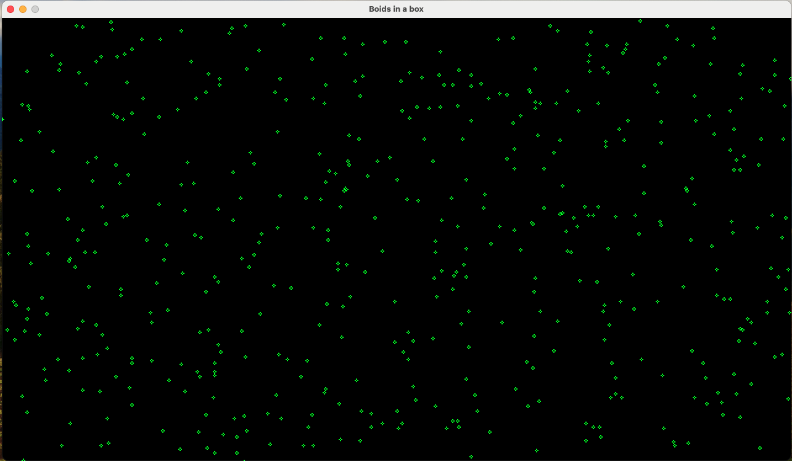
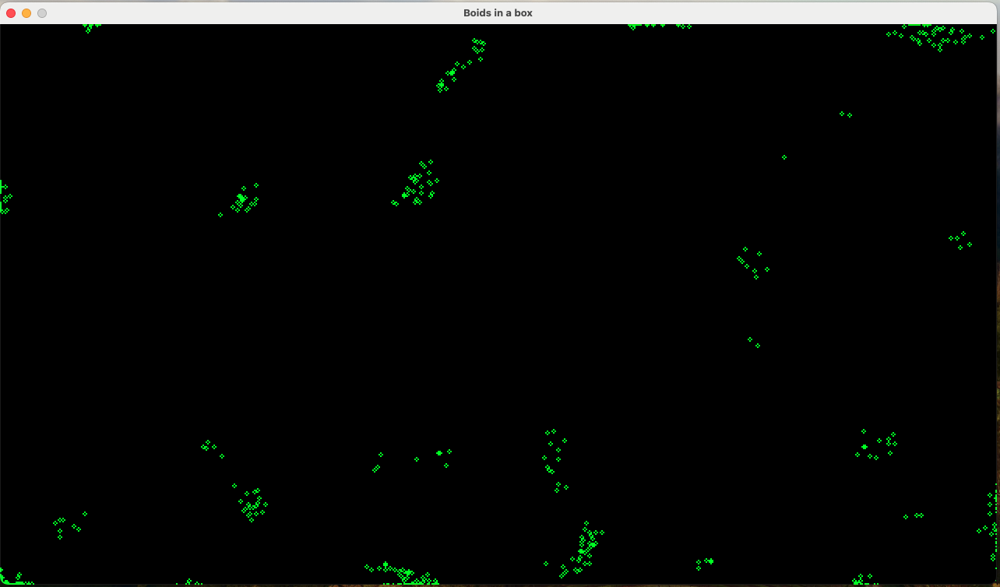
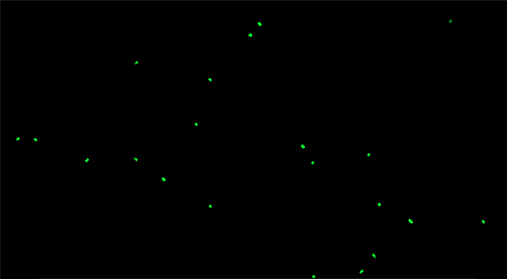
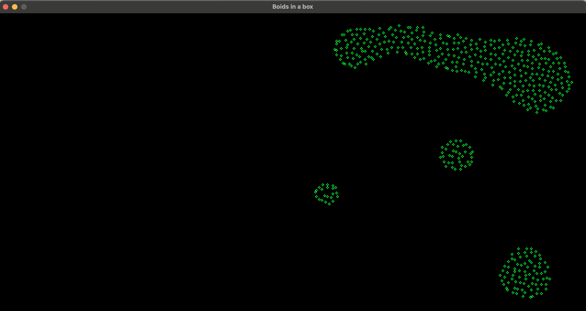

## Simulation of a group of birds using Goroutines

- As part of the Udemy course: [Mastering Multithreading Programming with Go (Golang)](https://www.udemy.com/course/multithreading-in-go-lang/)
- This code uses [Ebiten](https://pkg.go.dev/github.com/hajimehoshi/ebiten/v2) -> a 2D game library in Golang

### Step-by-step simulation
- Step-1: Use goroutines as each boid

- Step-2: Converge boids together by changing velocity to avg velocity of neighbors

- Step-3: Use Mutex for thread sync and implement cohesion.

- Step-4: Use RWMutex for faster thread sync and implement separation + better bounce-back algo.

### Key Concepts

- Function type declaration: Add(v1, v2 Vector) cleaner than Add(v1 Vector, v2 Vector)
- Thread communication is possible in 2 ways -- message passing and shared memory
  - Message passing -> exchanging letters with others
  - Shared memory -> sharing a whiteboard with others
- Race condition -> multiple threads modify the shared variables at the same time.
  - This leads to inconsistencies.
  - Solution: Lock/Mutex
  - A thread will acquire a lock before accessing shared state. 
    - This same thread has to release the lock before another thread can acquire the same lock.
    - No thread can acquire the lock twice. 
    - All other threads will wait for their turn.
- RWMutex is handy when we have a slow read-only portion and a fast write-only portion for shared state.
  - RWMutex allows multiple readers to access the read-only portion using RLock() and RUnlock().
  - As the threads are only reading stuff, this concurrent access is safe.
  - For writers, we continue to allow only one writer at a time similar to Mutex.
