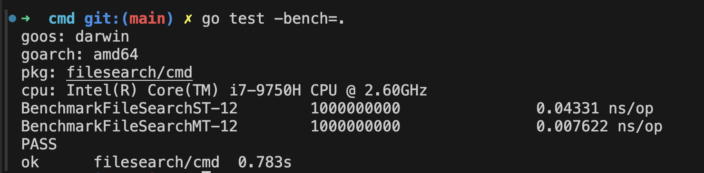

## Concurrent File Search
Compare single-threaded vs multi-threaded approach.
- Got a 5X improvement for a local folder.
  - ST = single threaded implementation
  - MT = multi threaded implementation

### Key Concepts
- os.ReadDir() -> read a directory in Go
- You can't copy a waitgroup. It is always passed as reference.